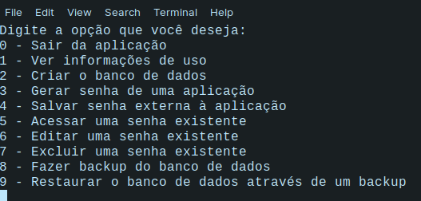

# Gerenciador-de-senhas

## O que é este projeto?
Este é um projeto de estudos envolvendo C++ e conexão com o banco de dados MySql que simula um gerenciador de senhas por linha de comando, onde é possível salvar senhas, criar senhas de um tamanho a escolha do usuário com diferentes tipos de caracteres buscando deixar a senha mais segura, sendo possível editar as senhas e excluí-las. 

Como a aplicação envolve o uso de banco de dados, é possível além de criar o banco de dados (o que deve ser feito na primeira utilização da aplicação) realizar backups e restaurar esses backups do banco de dados.

**IMPORTANTE: ao fazer o backup das senhas, é possível acessar todas as senhas cadastradas abrindo o arquivo de backup. Esse é um projeto de estudos, não uma aplicação comercial.**

## Como utilizar este projeto?
Antes de tudo, você precisa ter o MySQL instalado no seu computador para poder utilizar a aplicação, e um usuário configurado para acessar o servidor MySQL, pois a aplicação solicitará um usuário e senha já existentes e cadastrados no MySQL local para poder criar o banco de dados.

Para utilizar este projeto, basta fazer o download do repositório, o que pode ser feito pelo comando `git clone https://github.com/LelePG/Gerenciador-de-senhas` ou fazendo o download do arquivo .zip clicando no botão verde escrito *Code* e em seguida na opção de baixar o arquivo zip. Depois de baixado abra o terminal na pasta principal da aplicação (é necessário descompatar o arquivo, caso você tenha baixado a opção .zip) e execute o comando make, que compilará os arquivos necessários e executará a aplicação.

A partir disso, um menu será exibido, onde você pode selecionar as opções a partir de valores numéricos:

- 0 - Sair da aplicação
- 1 - Ver informações de uso
- 2 - Criar o banco de dados
- 3 - Gerar senha de uma aplicação
- 4 - Salvar senha externa à aplicação
- 5 - Acessar uma senha existente
- 6 - Editar uma senha existente
- 7 - Excluir uma senha existente
- 8 - Fazer backup do banco de dados
- 9 - Restaurar o banco de dados através de um backup

O backup sempre será salvo na pasta src, e se espera que ele também esteja nesta pasta caso seja necessário utilizar a restauração.

## Bibliotecas necessárias:
- MySQL Connector
- Vector
- Algorithm
- iostream
- stdlib

## Observações
- A porta padrão definida no algortimo para o acesso ao servidor MySQL é a porta 3306
- O banco de dados criado pela aplicação ainda pode ser acessado pelo terminal ou por qualquer que seja a forma que você utiliza para manipular bancos de dados
- A aplicação não permite a exclusão do banco de dados, o que você deve fazer manualmente

## Links úteis:
- [Manual de como utilizar o MySQL connector no c++](https://docs.huihoo.com/mysql/mysql-apps-using-connector-and-cpp.pdf)
- [Instalação do MySQL connector (documentação oficial)](https://dev.mysql.com/doc/connector-cpp/8.0/en/connector-cpp-installation-source.html)
- [Instalação do MySQL connector no linux](https://www.programmersought.com/article/24846121597/)

